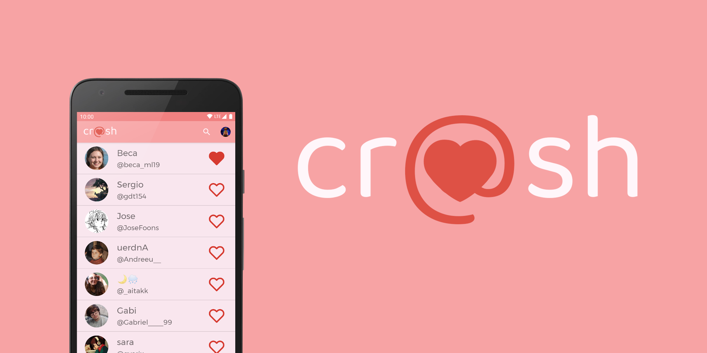
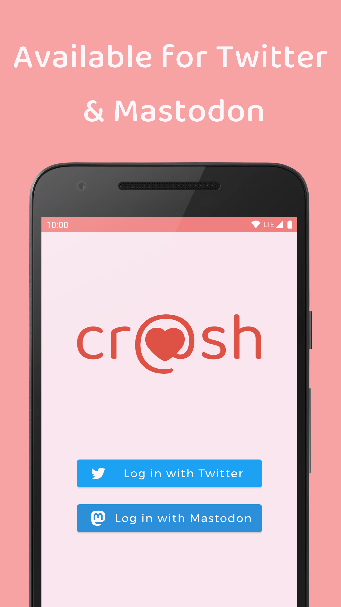
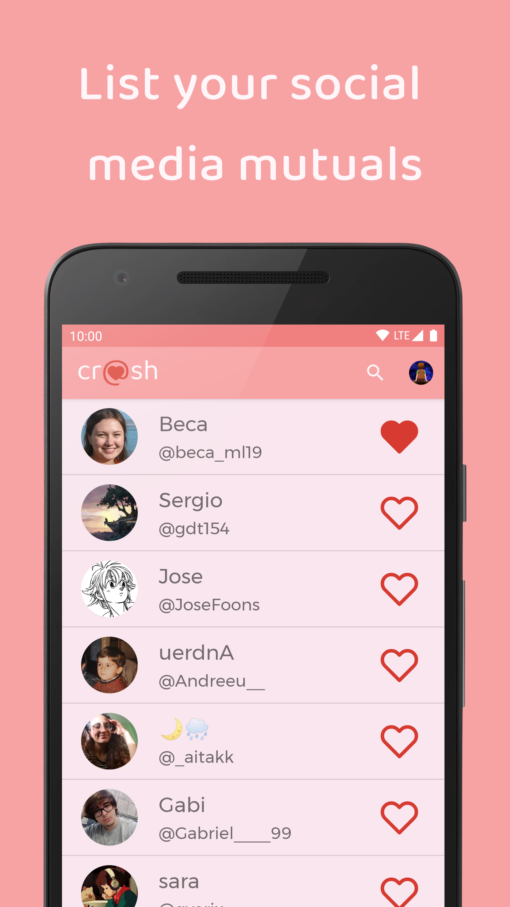
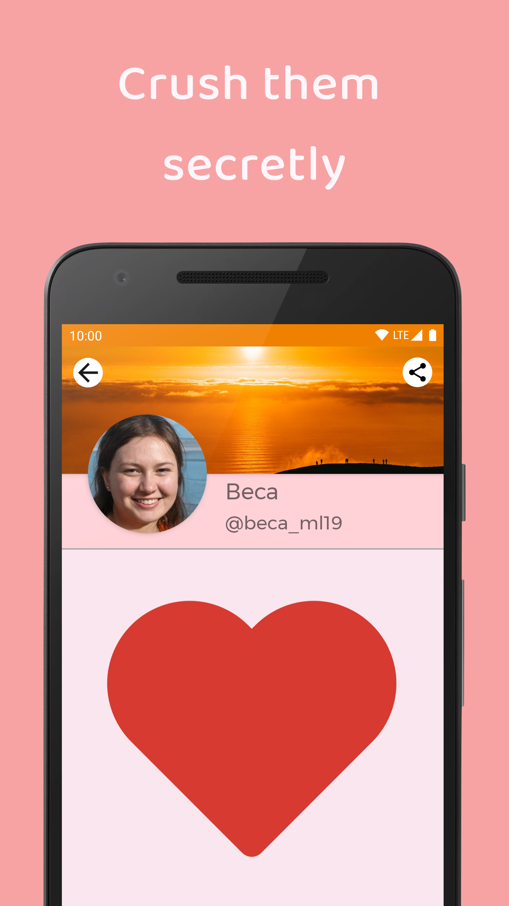
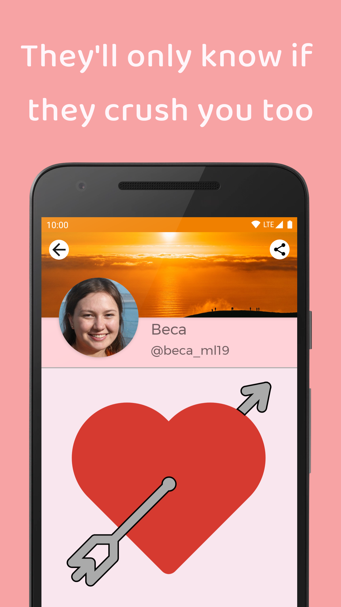
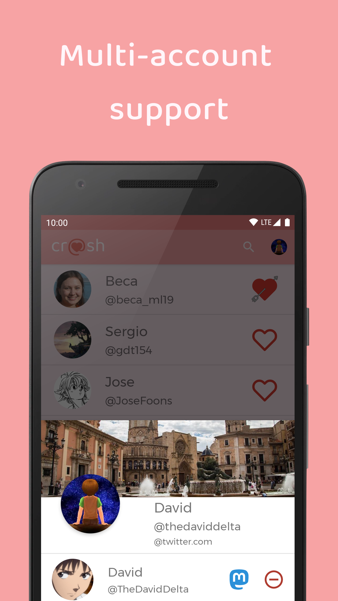
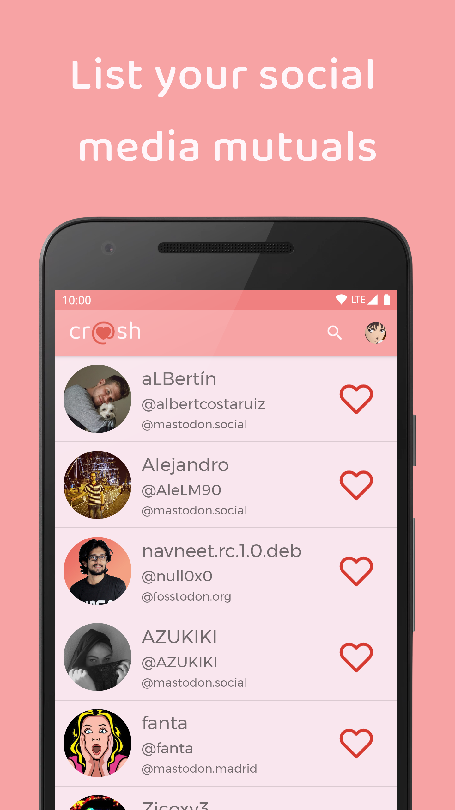
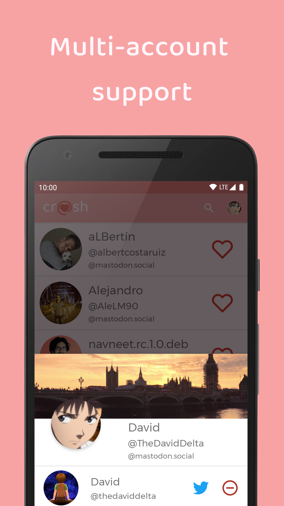

# 

> Secret crush matcher for social networks

## 💘 How does it work?

Have you ever liked someone, but aren't sure if it's mutual?

With ***cr@sh***, you're able to secretly select your *crushes*, who will only know if they *crush* you too!

For that purpose, you can login with your social media account (currently available for *Twitter* & *Mastodon*) and *crush* a maximum of 3 of your *mutuals* (people you follow mutually).

It's important to notice that **this is not a flirting app**, but an app for verifying mutual love on someone you already befriend with.

For keeping the integrity of this purpose, there are some intentional limitations:
+ **Maximum of 3 *crushes* per account**: So no one's able to *crush* all his friends, expecting to find anyone's love, a dirty way of improving flirting.
+ **Minimum of 1 week before *uncrushing***: So no one's able to instantly *crush* and *uncrush* someone, just for checking if they *crushed* them.

## 🖼️ Screenshots

    
    
    
    
    
    
    

## 💾 Open Source dependencies

+ **[AboutLibraries](https://github.com/mikepenz/AboutLibraries) by mikepenz** for info screen
+ **[java-dotenv](https://github.com/cdimascio/java-dotenv) by cdimascio** for storing Twitter consumers on a enviroment file
+ **[Retrofit](https://github.com/square/retrofit) by square** for building API servicies
+ **[Montserrat font](https://github.com/square/retrofit) by JulietaUla** as the application font
+ **[Baloo 2 font](https://github.com/square/retrofit) by EkType** on the logo, banner & screenshots

## 📧 Contact

You can contact me about anything related to this app on crash@thedaviddelta.com.

If you'd like to report a bug, you can use both the above email or the [GitHub Issues](https://github.com/TheDavidDelta/crash/issues) page.

## 📝 Others

Thanks to my friend Andreu for the idea of this app, and to both my parents for the support.

Copyright © 2020 [TheDavidDelta](https://github.com/TheDavidDelta).  
This project is [GNU GPLv3](./LICENSE) licensed.  
By using this application you accept the following [Privacy Policy](./PRIVACY_POLICY.md).
